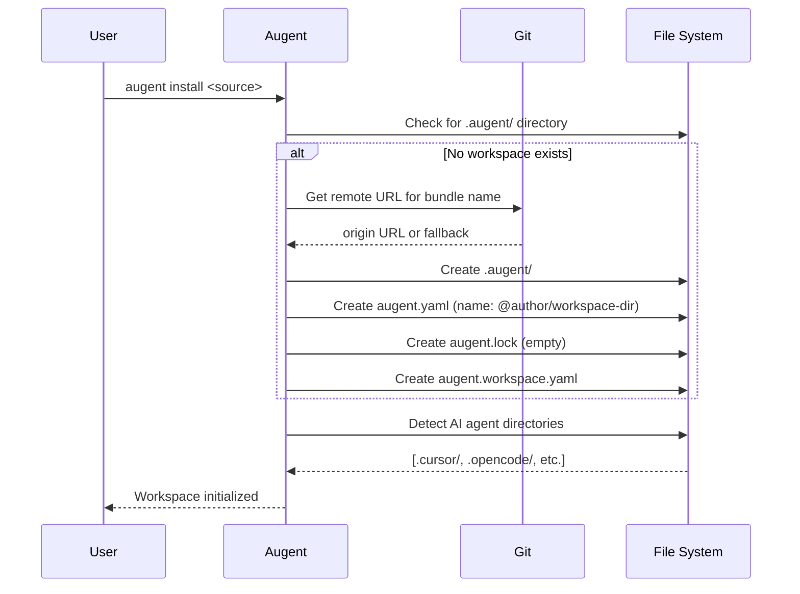
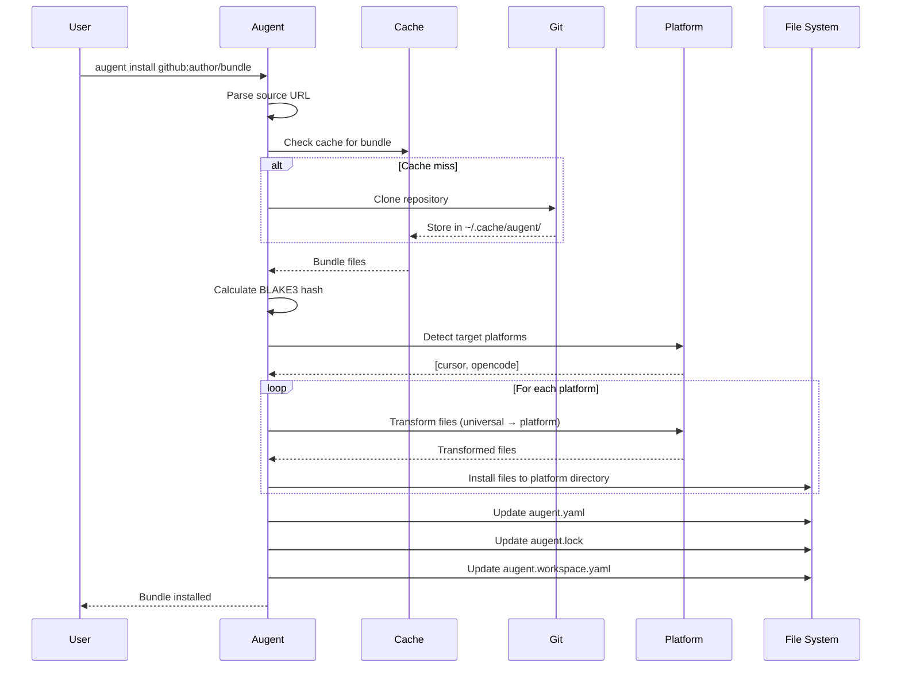
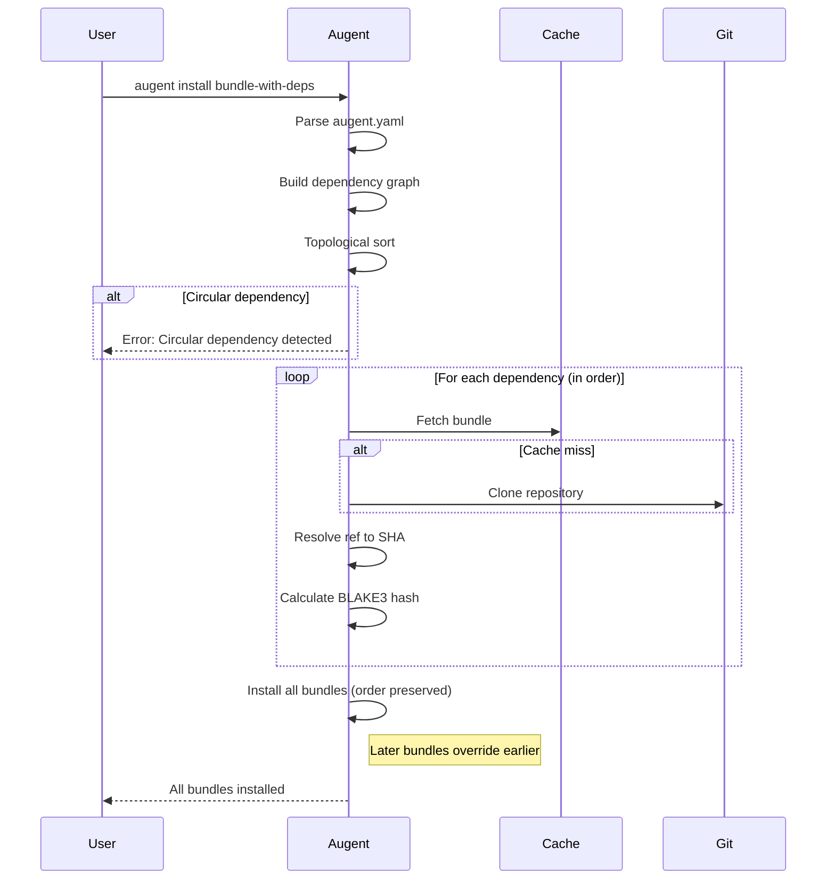
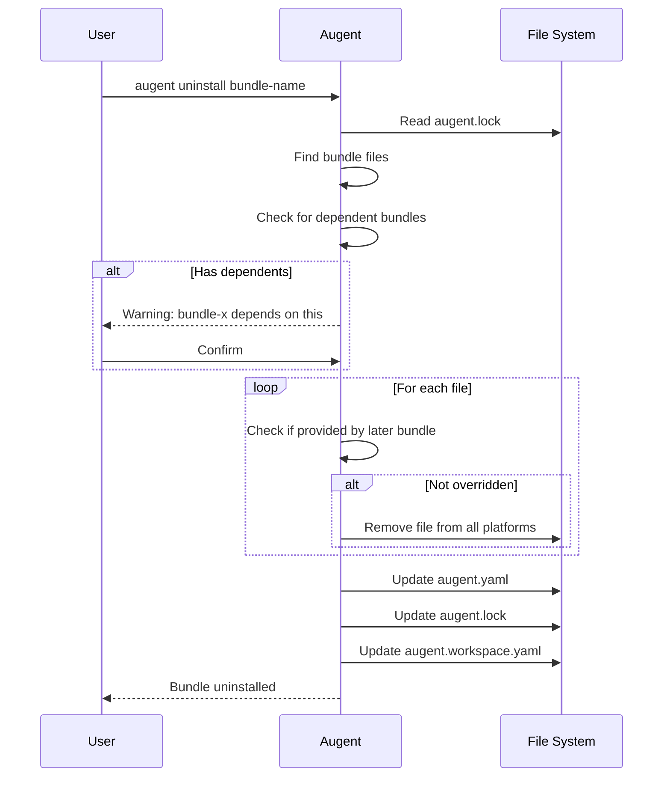
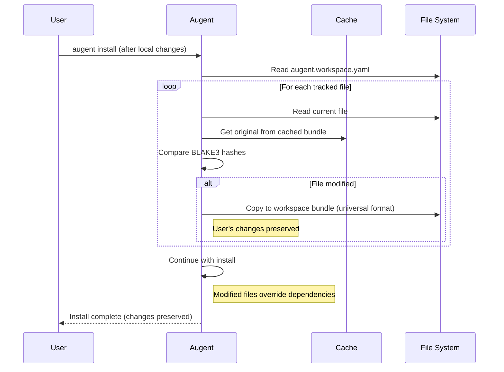
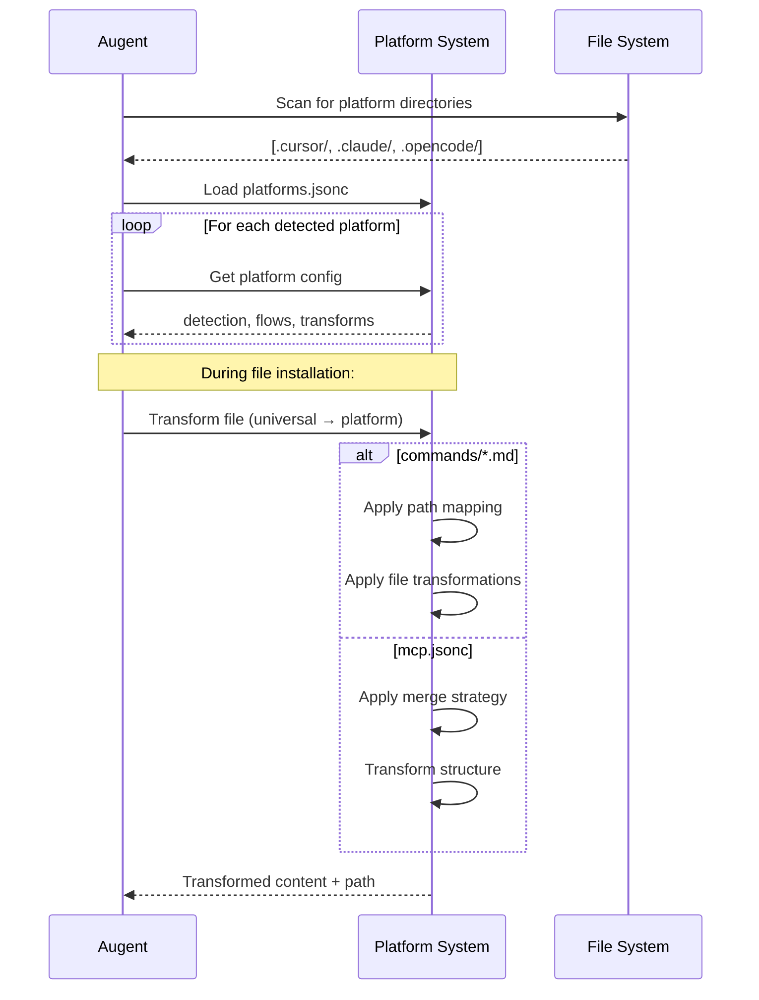

# Augent Architecture

## Overview

This document describes the architecture of Augent, an AI configuration manager for managing AI coding agent resources across multiple platforms.

---

## Key Concepts

### Bundle

A **Bundle** is a directory containing AI agent-independent resources. Bundles are distributed via Git repositories and can contain:

- `augent.yaml` - Bundle configuration and dependencies (optional)
- `augent.lock` - Resolved dependency versions (auto-generated)
- `commands/` - Command definitions
- `rules/` - Rule definitions
- `agents/` - Agent definitions
- `skills/` - Skill definitions
- `mcp.jsonc` - MCP server configuration
- `root/` - Files copied as-is to workspace root

### Workspace

A **Workspace** is a developer's working git repository with Augent configuration. It contains:

- `.augent/` - Augent workspace directory
- `.augent/augent.yaml` - Workspace bundle config
- `.augent/augent.lock` - Resolved dependencies
- `.augent/augent.workspace.yaml` - Per-agent file mappings
- `.augent/bundles/` - Local bundle directories

### Aug

An **Aug** is a resource file in AI agent-independent format. Examples:

- `commands/debug.md`
- `rules/lint.md`
- `mcp.jsonc`

### Augmentation

An **Augmentation** is a resource that has been installed for a specific AI agent in its native format. Examples:

- `.cursor/rules/debug.mdc` (Cursor-specific)
- `.opencode/commands/debug.md` (OpenCode-specific)
- `.claude/mcp.json` (Claude-specific)

---

## Fundamental Design Decisions

These are Type 1 decisions from the PRD that cannot be reversed.

### Configuration Manager, Not Package Manager

Augent is a **configuration manager**. It manages AI agent resources, not software dependencies. This means:

- No semantic versioning or version ranges
- No development vs. production dependencies
- Exact refs (branches, tags, SHAs) only
- Lockfile resolves refs to exact git SHAs

### Git-Based Distribution

Bundles are distributed via Git repositories:

- Any Git host (GitHub, GitLab, self-hosted)
- HTTPS or SSH authentication (delegated to git)
- Subdirectories supported (`github:user/repo#plugins/name`)
- Refs supported (`github:user/repo#v1.0.0`)

### Bundle Override Order

Bundles install in order. Later bundles override earlier ones when file names overlap:

- Non-merged files (commands, rules, skills): Complete replacement
- Merged files (AGENTS.md, mcp.jsonc): Platform-specific merge behavior
- Override is silent (no warnings shown)

### Atomic Operations

All operations are atomic:

- Workspace is never left in inconsistent state
- Failed operations roll back all changes
- Configuration files backed up before modification

### Platform Extensibility

Support for new AI agents via `platforms.jsonc`:

- No code changes required
- Detection patterns
- Directory mappings
- Transformation flows
- Merge strategies

---

## User Workflows

### Initial Workspace Setup



### Installing a Bundle



### Installing with Dependencies



### Uninstalling a Bundle



### Modified File Detection and Handling



### Platform Detection and Resource Transformation



---

## Rust Development Practices

### Project Structure

```text
augent/
├── Cargo.toml
├── src/
│   ├── main.rs           # CLI entry point
│   ├── cli.rs            # CLI definitions (clap)
│   ├── error.rs          # Error types (thiserror + miette)
│   ├── config/
│   │   ├── mod.rs
│   │   ├── bundle.rs     # augent.yaml structures
│   │   ├── lockfile.rs   # augent.lock structures
│   │   └── workspace.rs  # augent.workspace.yaml structures
│   ├── platform/
│   │   ├── mod.rs
│   │   ├── detection.rs  # Platform detection
│   │   └── transform.rs  # Transformation engine
│   ├── git/
│   │   └── mod.rs        # Git operations
│   ├── cache/
│   │   └── mod.rs        # Bundle caching
│   └── commands/
│       ├── mod.rs
│       ├── install.rs
│       ├── uninstall.rs
│       ├── list.rs
│       └── show.rs
├── tests/
│   ├── common/
│   │   └── mod.rs        # Test utilities
│   ├── install_tests.rs
│   └── ...
└── docs/
```

### Error Handling

Use `thiserror` for error definitions and `miette` for pretty diagnostics:

```rust
use miette::{Diagnostic, NamedSource, SourceSpan};
use thiserror::Error;

#[derive(Error, Diagnostic, Debug)]
pub enum AugentError {
    #[error("Bundle not found: {name}")]
    #[diagnostic(code(augent::bundle::not_found))]
    BundleNotFound { name: String },

    #[error("Circular dependency detected")]
    #[diagnostic(
        code(augent::deps::circular),
        help("Check the dependency chain: {chain}")
    )]
    CircularDependency { chain: String },
}
```

### Configuration Parsing

Use `serde` with validation:

```rust
use serde::{Deserialize, Serialize};

#[derive(Debug, Serialize, Deserialize)]
pub struct BundleConfig {
    pub name: String,
    #[serde(default)]
    pub bundles: Vec<BundleDependency>,
}

impl BundleConfig {
    pub fn validate(&self) -> Result<()> {
        // Validation logic
    }
}
```

### BLAKE3 Hashing

Use `blake3` for content hashing:

```rust
use blake3::Hasher;

pub fn hash_directory(path: &Path) -> String {
    let mut hasher = Hasher::new();
    // Hash all files recursively
    format!("blake3:{}", hasher.finalize().to_hex())
}
```

---

## Architecture Decision Records (ADR)

### ADR-001: Bundle Format

**Status:** Accepted
**Date:** 2026-01-22

**Context:**
Need a format for distributing AI agent resources that is simple, git-friendly, and platform-independent.

**Decision:**

- Bundle is a directory with optional `augent.yaml`
- Resources in platform-independent format (markdown, jsonc)
- No compilation or build step required
- Compatible with existing Claude Code plugins

**Consequences:**

- Easy adoption (just clone a repo)
- Can work without any configuration file
- Transformation happens at install time

---

### ADR-002: Platform System

**Status:** Accepted
**Date:** 2026-01-22

**Context:**
Need to support many AI agents (Claude, Cursor, OpenCode, etc.) with different file formats and directory structures.

**Decision:**

- Adopt flow-based transformation system (inspired by OpenPackage)
- `platforms.jsonc` defines detection, mappings, and transforms
- Bidirectional: universal ↔ platform-specific
- Merge strategies: replace, shallow, deep, composite

**Key Platform Mappings:**

| Universal Path | Claude | Cursor | OpenCode |
|---------------|--------|--------|----------|
| `commands/*.md` | `.claude/commands/*.md` | `.cursor/rules/*.mdc` | `.opencode/commands/*.md` |
| `rules/*.md` | `.claude/rules/*.md` | `.cursor/rules/*.mdc` | `.opencode/rules/*.md` |
| `agents/*.md` | `.claude/agents/*.md` | `.cursor/agents/*.md` | `.opencode/agents/*.md` |
| `mcp.jsonc` | `.claude/mcp.json` | N/A | `.opencode/mcp.json` |
| `AGENTS.md` | `CLAUDE.md` | `AGENTS.md` | `AGENTS.md` |

**Consequences:**

- New platforms added without code changes
- User can customize mappings per workspace
- Bidirectional sync enables import from existing setups

---

### ADR-003: Locking Mechanism

**Status:** Accepted
**Date:** 2026-01-22

**Context:**
Need reproducible installations across team members and CI/CD.

**Decision:**

- `augent.lock` resolves all refs to exact git SHAs
- BLAKE3 hash for each bundle's contents
- All files provided by each bundle listed
- Lockfile updated on `install`, validated on `--frozen`

**Lockfile Format:**

```json
{
  "name": "@author/my-bundle",
  "bundles": [
    {
      "name": "dependency",
      "source": {
        "type": "git",
        "url": "https://github.com/...",
        "sha": "abc123...",
        "hash": "blake3:..."
      },
      "files": ["commands/debug.md"]
    }
  ]
}
```

**Consequences:**

- Exact reproducibility with `--frozen`
- Can trace any file back to its source bundle
- Hash verification detects tampering

---

### ADR-004: Atomic Operations

**Status:** Accepted
**Date:** 2026-01-22

**Context:**
Operations like `install` and `uninstall` modify multiple files. Failures mid-operation could leave workspace in inconsistent state.

**Decision:**

- Backup configuration files before modification
- Track all file operations during command execution
- On any error, rollback all changes
- Use OS-level advisory locks to prevent concurrent modification

**Implementation:**

```rust
pub struct Transaction {
    backups: Vec<(PathBuf, Vec<u8>)>,
    created_files: Vec<PathBuf>,
}

impl Transaction {
    pub fn rollback(&self) -> Result<()> {
        // Restore backups
        // Remove created files
    }
}
```

**Consequences:**

- Workspace never left in inconsistent state
- Safe to Ctrl+C during operations
- Clear error messages on failure

---

## Platform System Details

### Detection

Platforms are detected by checking for marker directories and files:

```jsonc
{
  "claude": {
    "detection": [".claude", "CLAUDE.md"]
  },
  "cursor": {
    "detection": [".cursor", "AGENTS.md"]
  },
  "opencode": {
    "detection": [".opencode", "AGENTS.md"]
  }
}
```

### Transformation Flows

Export flow (universal → platform):

```jsonc
{
  "export": [
    {
      "from": "commands/**/*.md",
      "to": ".${platform}/commands/**/*.md"
    },
    {
      "from": "mcp.jsonc",
      "to": ".${platform}/mcp.json",
      "map": { "$rename": { "mcpServers": "servers" } }
    }
  ]
}
```

### Merge Strategies

| Strategy | Behavior | Use Case |
|----------|----------|----------|
| `replace` | Overwrite entire file | Commands, rules |
| `shallow` | Merge top-level keys | Simple configs |
| `deep` | Recursive merge | Nested configs |
| `composite` | Append with delimiter | AGENTS.md |

---

## Cache System

### Directory Structure

```text
~/.cache/augent/
└── bundles/
    └── <url-path-slug>/
        └── <git-sha>/
            └── <bundle-contents>
```

### Cache Key Generation

URL slug: `github.com/author/repo` → `github.com-author-repo`

### Cache Behavior

- Check cache before git clone
- Store by SHA (immutable)
- Optional cleanup for old entries (future)

---

## Concurrency

### Workspace Locking

Use `fslock` for advisory file locks:

```rust
use fslock::LockFile;

pub struct WorkspaceGuard {
    lock: LockFile,
}

impl WorkspaceGuard {
    pub fn acquire(path: &Path) -> Result<Self> {
        let mut lock = LockFile::open(&path.join(".augent/.lock"))?;
        lock.lock()?; // Blocking
        Ok(Self { lock })
    }
}

impl Drop for WorkspaceGuard {
    fn drop(&mut self) {
        self.lock.unlock().ok();
    }
}
```

### CI/CD Considerations

- `--frozen` flag for reproducible builds
- Fails fast if lockfile is outdated
- Git auth via environment (SSH keys, tokens)

---

## Notes

- This document should be updated when architectural decisions change
- ADRs are append-only (never removed, only superseded)
- Sequence diagrams rendered with Mermaid
