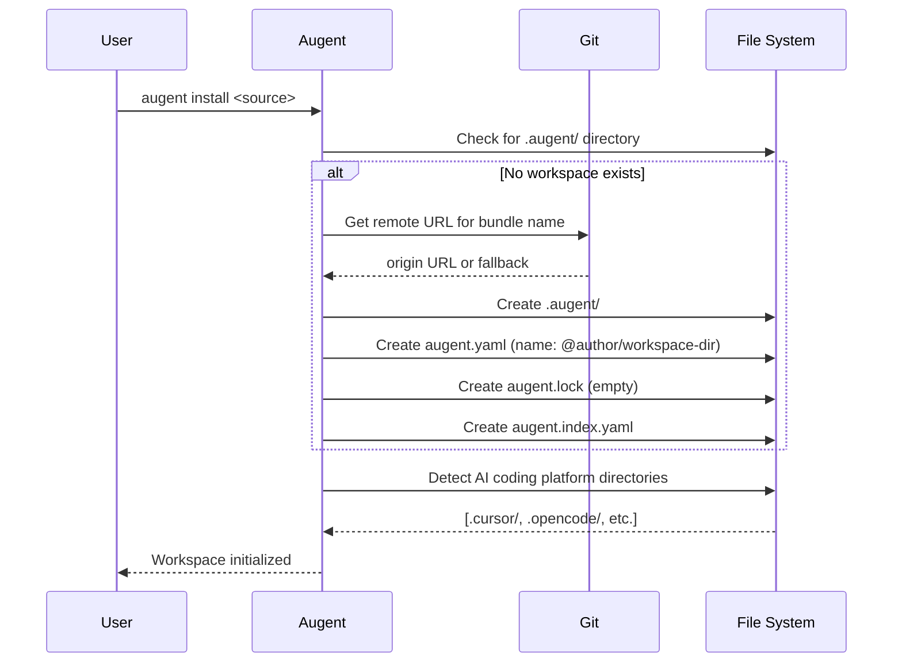
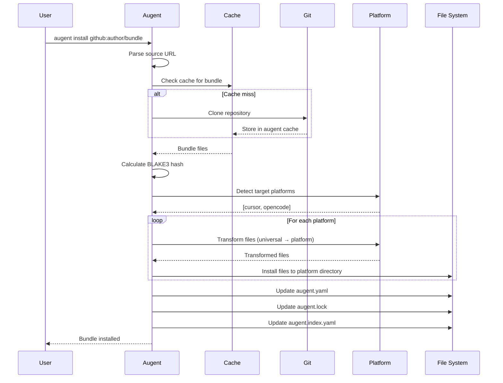
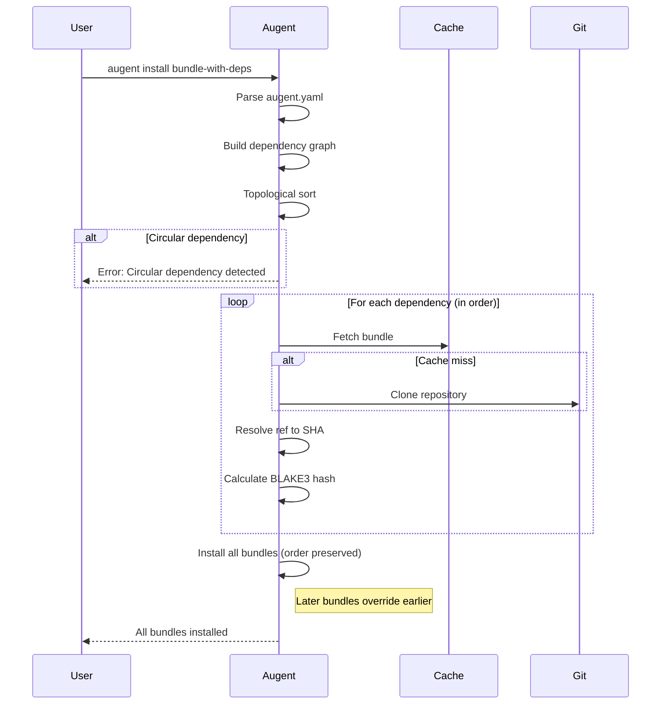
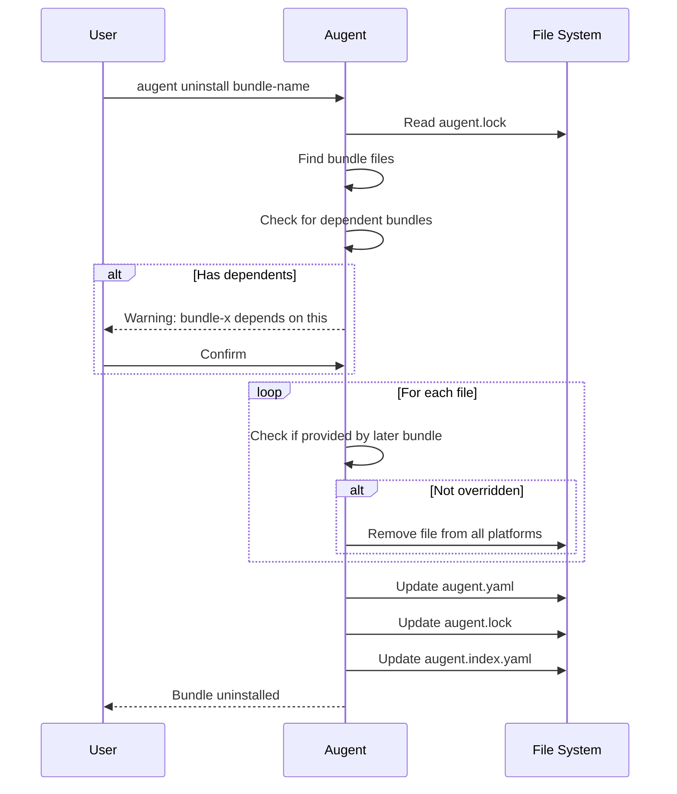
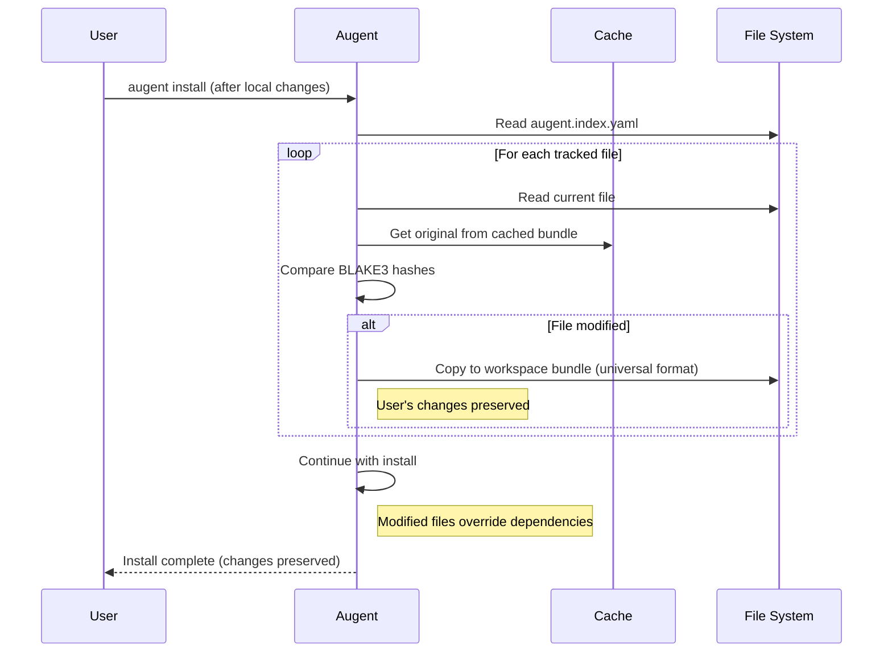
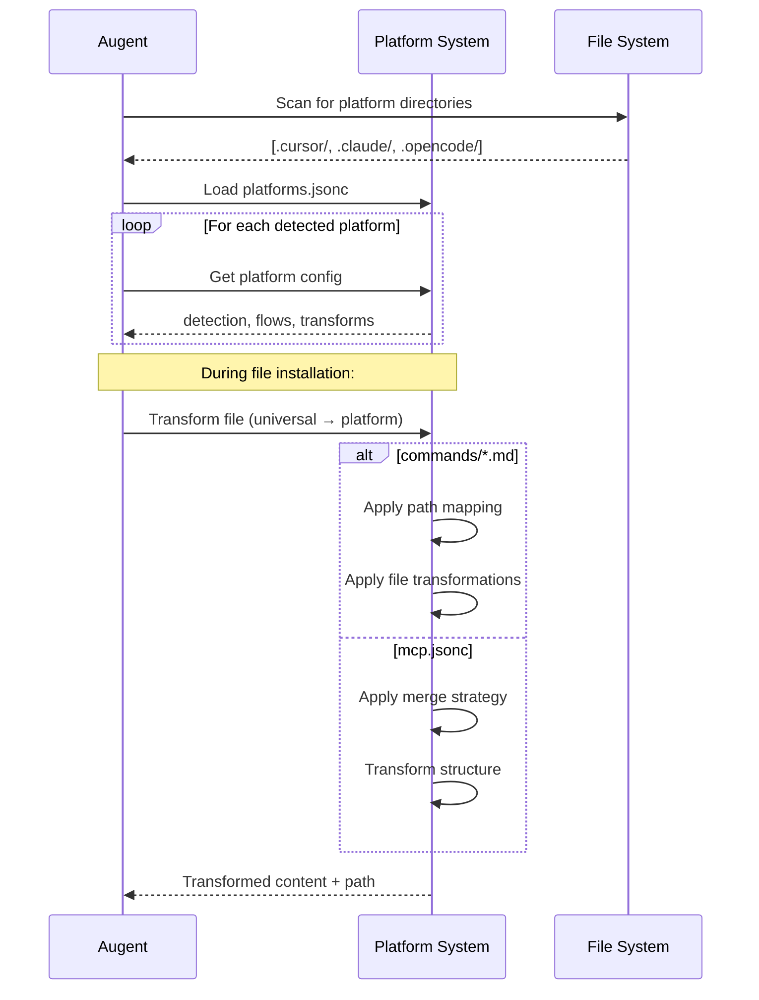

# Augent Architecture

## Overview

This document describes the architecture of Augent, an AI package manager for managing AI coding platform resources across multiple platforms.

---

## Key Concepts

### Bundle

A **Bundle** is a directory containing platform-independent resources. Bundles can exist with or without `augent.yaml`. When a bundle has `augent.lock`, what gets installed is dictated by that lockfile (the bundle's own resources last). Bundles are distributed via Git repositories or local directories and can contain:

- `augent.yaml` - Bundle metadata and dependencies (optional)
- `augent.lock` - What to install, in order (optional; when present, install follows it)
- `commands/` - Command definitions
- `rules/` - Rule definitions
- `agents/` - Agent definitions
- `skills/` - Skill definitions
- `mcp.jsonc` - MCP server configuration
- `root/` - Files copied as-is to workspace root

Bundle naming and how install records bundles in the workspace are defined in the [Bundles spec](specs/bundles.md) (e.g. dir name = directory name; Git name = `@owner/repo` or `@owner/repo:path`; ref stored in lockfile).

### Workspace

A **Workspace** is a developer's working git repository with Augent configuration. It contains:

- `.augent/` - Augent workspace directory
- `.augent/augent.yaml` - Workspace bundle config
- `.augent/augent.lock` - Resolved dependencies
- `.augent/augent.index.yaml` - Per-agent file mappings
- `.augent/bundles/` - Local bundle directories

### Resources

Resources are platform-independent files that get transformed at install time. Examples:

- `commands/debug.md`
- `rules/lint.md`
- `mcp.jsonc`

Or in platform-specific format after installation.

- `.cursor/rules/debug.mdc` (Cursor-specific)
- `.opencode/commands/debug.md` (OpenCode-specific)
- `.claude/mcp.json` (Claude-specific)

---

## Fundamental Design Decisions

These are Type 1 decisions from the PRD that cannot be reversed.

### Package Manager

Augent is a **package manager**. It manages AI coding platform resources, not software dependencies. This means:

- No semantic versioning or version ranges
- No development vs. production dependencies
- Exact refs (branches, tags, SHAs) only
- Lockfile resolves refs to exact git SHAs

### Git-Based Distribution

Bundles are distributed via Git repositories:

- Any Git host (GitHub, GitLab, self-hosted)
- HTTPS or SSH authentication (delegated to git)
- Subdirectories supported (`owner/repo:path/from/repo/root`; path after `:`)
- Refs supported; exact SHA stored in lockfile for reproducibility

### Bundle Override Order

Bundles install in order. Later bundles override earlier ones when file names overlap:

- Non-merged files (commands, rules, skills): Complete replacement
- Merged files (AGENTS.md, mcp.jsonc): Platform-specific merge behavior
- Override is silent (no warnings shown)

### Atomic Operations

All operations are atomic:

- Workspace is never left in inconsistent state
- Failed operations roll back all changes
- Configuration files backed up before modification

### Platform Extensibility

Support for new AI coding platforms via `platforms.jsonc`:

- No code changes required
- Detection patterns
- Directory mappings
- Transformation flows
- Merge strategies

---

## User Workflows

### Initial Workspace Setup



### Installing a Bundle



### Installing with Dependencies



### Uninstalling a Bundle



### Modified File Detection and Handling



### Platform Detection and Resource Transformation



---

## Rust Development Practices

### Project Structure

```text
augent/
├── Cargo.toml
├── src/
│   ├── main.rs           # CLI entry point
│   ├── cli.rs            # CLI definitions (clap)
│   ├── error.rs          # Error types (thiserror + miette)
│   ├── hash.rs           # BLAKE3 hashing for integrity verification
│   ├── progress.rs       # Progress reporting for long-running operations
│   ├── config/
│   │   ├── mod.rs
│   │   ├── bundle.rs     # augent.yaml structures
│   │   ├── lockfile.rs   # augent.lock structures
│   │   ├── index.rs  # augent.index.yaml structures
│   │   └── marketplace.rs # marketplace.json parsing
│   ├── platform/
│   │   ├── mod.rs
│   │   ├── detection.rs  # Platform detection
│   │   ├── loader.rs     # Platform configuration loading
│   │   └── merge.rs       # Merge strategies for special files
│   ├── git/
│   │   └── mod.rs        # Git operations
│   ├── cache/
│   │   └── mod.rs        # Bundle caching
│   ├── source/
│   │   ├── mod.rs
│   │   └── bundle.rs     # Bundle source parsing and models
│   ├── resolver/
│   │   └── mod.rs        # Dependency resolution
│   ├── installer/
│   │   └── mod.rs        # Installation and uninstallation logic
│   ├── transaction/
│   │   └── mod.rs        # Transaction management for atomic operations
│   ├── workspace/
│   │   └── mod.rs        # Workspace management and initialization
│   └── commands/
│       ├── mod.rs
│       ├── install.rs
│       ├── uninstall.rs
│       ├── list.rs
│       ├── show.rs
│       ├── clean_cache.rs
│       ├── completions.rs
│       ├── version.rs
│       └── menu.rs        # Interactive menu for bundle selection
├── tests/
│   ├── common/
│   │   └── mod.rs        # Test utilities and fixtures
│   ├── install_tests.rs
│   └── ...
└── docs/
```

### Error Handling

Use `thiserror` for error definitions and `miette` for pretty diagnostics:

```rust
use miette::{Diagnostic, NamedSource, SourceSpan};
use thiserror::Error;

#[derive(Error, Diagnostic, Debug)]
pub enum AugentError {
    #[error("Bundle not found: {name}")]
    #[diagnostic(code(augent::bundle::not_found))]
    BundleNotFound { name: String },

    #[error("Circular dependency detected")]
    #[diagnostic(
        code(augent::deps::circular),
        help("Check the dependency chain: {chain}")
    )]
    CircularDependency { chain: String },
}
```

### Configuration Parsing

Use `serde` with validation:

```rust
use serde::{Deserialize, Serialize};

#[derive(Debug, Serialize, Deserialize)]
pub struct BundleConfig {
    pub name: String,
    #[serde(default)]
    pub bundles: Vec<BundleDependency>,
}

impl BundleConfig {
    pub fn validate(&self) -> Result<()> {
        // Validation logic
    }
}
```

### BLAKE3 Hashing

Use `blake3` for content hashing:

```rust
use blake3::Hasher;

pub fn hash_directory(path: &Path) -> String {
    let mut hasher = Hasher::new();
    // Hash all files recursively
    format!("blake3:{}", hasher.finalize().to_hex())
}
```

---

## Architecture Decision Records (ADR)

ADRs have been moved to [adrs/](./adrs/) directory for better organization and maintainability.

- [ADR-001: Bundle Format](./adrs/001-bundle-format.md)
- [ADR-002: Platform System](./adrs/002-platform-system.md)
- [ADR-003: Locking Mechanism](./adrs/003-locking-mechanism.md)
- [ADR-004: Atomic Operations](./adrs/004-atomic-operations.md)

---

## Platform System Details

### Detection

Platforms are detected by checking for marker directories and files:

```jsonc
{
  "claude": {
    "detection": [".claude", "CLAUDE.md"]
  },
  "cursor": {
    "detection": [".cursor", "AGENTS.md"]
  },
  "opencode": {
    "detection": [".opencode", "AGENTS.md"]
  }
}
```

### Transformation Flows

Export flow (universal → platform):

```jsonc
{
  "export": [
    {
      "from": "commands/**/*.md",
      "to": ".${platform}/commands/**/*.md"
    },
    {
      "from": "mcp.jsonc",
      "to": ".${platform}/mcp.json",
      "map": { "$rename": { "mcpServers": "servers" } }
    }
  ]
}
// Note: OpenCode uses .opencode/opencode.json (MCP key in main config), not .opencode/mcp.json
```

### Merge Strategies

| Strategy | Behavior | Use Case |
|----------|----------|----------|
| `replace` | Overwrite entire file | Commands, rules |
| `shallow` | Merge top-level keys | Simple configs |
| `deep` | Recursive merge | MCP config, nested configs |
| `composite` | Append with delimiter | AGENTS.md, root files |

---

## Cache System

### Directory Structure

```text
<cache_dir>/augent/   (cache_dir is platform-specific; run `augent cache` to see it)
└── bundles/
    └── <url-path-slug>/
        └── <git-sha>/
            └── <bundle-contents>
```

### Cache Key Generation

URL slug: `github.com/author/repo` → `github.com-author-repo`

### Cache Behavior

- Check cache before git clone
- Store by SHA (immutable)
- Optional cleanup for old entries (future)

---

## Concurrency

### CI/CD Considerations

- `--frozen` flag for reproducible builds
- Fails fast if lockfile is outdated
- Git auth via environment (SSH keys, tokens)

---

## Notes

- This document should be updated when architectural decisions change
- ADRs are append-only (never removed, only superseded)
- Sequence diagrams rendered with Mermaid
